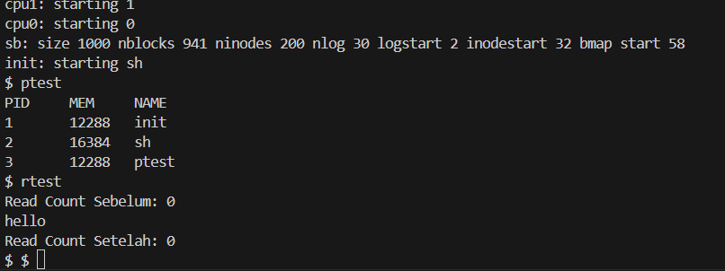

# 📝 Laporan Tugas Akhir

**Mata Kuliah**: Sistem Operasi
**Semester**: Genap / Tahun Ajaran 2024–2025
**Nama**: `<Mohamad Gilang Rizki Riomdona>`
**NIM**: `<240202903>`
**Modul yang Dikerjakan**:
`(Modul 1 – System Call dan Instrumentasi Kernel)`

---

## 📌 Deskripsi Singkat Tugas

* **Modul 1 – System Call dan Instrumentasi Kernel**:
  Menambahkan dua system call baru, yaitu `getpinfo()` untuk melihat proses yang aktif dan `getReadCount()` untuk menghitung jumlah pemanggilan `read()` sejak boot.
---

## 🛠️ Rincian Implementasi
* Menambahkan dua system call baru di file `sysproc.c` dan `syscall.c`
* Mengedit `user.h`, `usys.S`, dan `syscall.h` untuk mendaftarkan syscall
* Menambahkan struktur `struct pinfo` di `proc.h`
* Menambahkan counter `readcount` di kernel
* Membuat dua program uji: `ptest.c` dan `rtest.c`
* Mengimplementasikan fungsi `sys_getpinfo()` dan `sys_getreadcount()` di `sysproc.c`
* Memodifikasi `sys_read()` pada `sysfile.c` untuk menambah counter readcount
* Menambahkan kedua program uji `ptest` dan `rtest` ke dalam `Makefile`

## ✅ Uji Fungsionalitas

* `ptest`: untuk menguji `getpinfo()`
* `rtest`: untuk menguji `getReadCount()`
## 📷 Hasil Uji

### 📍 Output `ptest`:

```
$ ptest
PID	MEM	NAME
1	12288	init
2	16384	sh
3	12288	ptest
...

$ rtest
Read Count Sebelum: 0
hello
Read Count Setelah: 0
```


screenshot:

```



```

---

## ⚠️ Kendala yang Dihadapi

Tuliskan kendala (jika ada), misalnya:

* Kesalahan pada argptr() di sys_getpinfo apabila pointer tidak diverifikasi dengan benar, menyebabkan crash.
* Sempat mengalami kesalahan saat menggunakan ptable_lock, karena struktur tersebut tidak tersedia di versi xv6-public. Solusinya adalah menggunakan ptable.lock.
* Lupa menambahkan entri program uji (_ptest dan _rtest) di Makefile, sehingga awalnya program tidak dikenali di shell xv6.


---

## 📚 Referensi

* Buku xv6 MIT: [https://pdos.csail.mit.edu/6.828/2018/xv6/book-rev11.pdf](https://pdos.csail.mit.edu/6.828/2018/xv6/book-rev11.pdf)
* Repositori xv6-public: [https://github.com/mit-pdos/xv6-public](https://github.com/mit-pdos/xv6-public)
* Stack Overflow, GitHub Issues, diskusi praktikum

---

