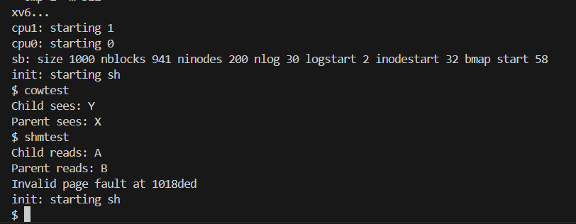

# 📝 Laporan Tugas Akhir

**Mata Kuliah**: Sistem Operasi
**Semester**: Genap / Tahun Ajaran 2024–2025
**Nama**: `Mohamad Gilang Rizki Riomdona`
**NIM**: `240202903`
**Modul yang Dikerjakan**:
`(Modul 3 - Manajemen Memori Tingkat Lanjut (Copy-on-Write & Shared Memory))`

---

## 📌 Deskripsi Singkat Tugas

Tuliskan deskripsi singkat dari modul yang Anda kerjakan. Misalnya:

**Modul 3 – Manajemen Memori Tingkat Lanjut (Copy-on-Write & Shared Memory)**:
 Modul ini berfokus pada pengembangan manajemen memori di kernel xv6 melalui dua fitur utama:
* Copy-on-Write Fork (CoW): Optimalisasi `fork()` dengan menunda duplikasi halaman memori hingga proses melakukan penulisan.
* Shared Memory: Mekanisme berbagi memori antar proses menggunakan `API shmget(int key)` dan `shmrelease(int key)`, menyerupai model System V Shared Memory.
---

## 🛠️ Rincian Implementasi

### Copy-on-Write Fork:

* Menambahkan array `ref_count[]` untuk menghitung referensi setiap halaman fisik `(vm.c)`
* Membuat fungsi `incref()` dan `decref()` untuk manajemen reference count
* Menambahkan flag `PTE_COW` di `mmu.h`
* Mengganti `copyuvm()` dengan `cowuvm()` di `fork()` `(proc.c)`
* Memodifikasi `trap()` di `trap.c` untuk menangani page fault akibat write pada halaman CoW
* Menyisipkan mekanisme `memmove()` dan `kalloc()` pada saat CoW-triggered fault

### Shared Memory:
* Menambahkan struktur `shmtab[]` untuk menyimpan data `shared memory` `(vm.c)`
* Mengimplementasikan `syscall` `shmget(int key)` dan `shmrelease(int key)` di `sysproc.c`
* Mendaftarkan `syscall` pada `syscall.c`, `syscall.h`, `user.h`, dan `usys.S`
* Melakukan mapping shared memory di alamat user `(USERTOP - n*PGSIZE)`
  
---

## ✅ Uji Fungsionalitas

* `cowtest`: menguji apakah proses anak membuat salinan hanya saat menulis ke memori (lazy copy)
* `shmtest`: menguji proses anak dan induk dapat mengakses halaman shared memory yang sama menggunakan key
---

## 📷 Hasil Uji

Output `cowtest`:

```
Child sees: Y
Parent sees: X
```

Contoh Output `shmtest`:

```
Child reads: A
Parent reads: B
```

## 📷 screenshot:





---

## ⚠️ Kendala yang Dihadapi

Tuliskan kendala (jika ada), misalnya:

* Kernel panic saat terjadi page fault karena handler tidak memeriksa apakah halaman yang diakses memiliki flag PTE_COW, sehingga proses langsung dibunuh.
* Lupa memodifikasi flag halaman menjadi PTE_COW di cowuvm(), sehingga mekanisme Copy-on-Write tidak berjalan dan fork tetap melakukan duplikasi memori seperti biasa.
* Shared memory tidak sinkron antara proses parent dan child karena setiap proses memetakan halaman ke alamat virtual yang berbeda-beda.

---

## 📚 Referensi

* Buku xv6 MIT: [https://pdos.csail.mit.edu/6.828/2018/xv6/book-rev11.pdf](https://pdos.csail.mit.edu/6.828/2018/xv6/book-rev11.pdf)
* Repositori xv6-public: [https://github.com/mit-pdos/xv6-public](https://github.com/mit-pdos/xv6-public)
* Stack Overflow, GitHub Issues, diskusi praktikum

---

