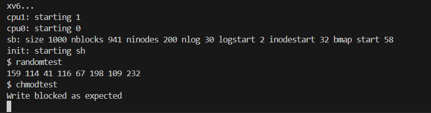

# 📝 Laporan Tugas Akhir

**Mata Kuliah**: Sistem Operasi
**Semester**: Genap / Tahun Ajaran 2024–2025
**Nama**: `Mohamad Gilang Rizki Riomdona`
**NIM**: `240202903`
**Modul yang Dikerjakan**:
`(Modul 4 – Subsistem Kernel Alternatif (xv6-public))`

---

## 📌 Deskripsi Singkat Tugas

**Modul 4 – Subsistem Kernel Alternatif**:
  
  Mengimplementasi dua fitur pada kernel xv6:
  * Menambahkan `system call baru` `chmod()` untuk mengatur mode file `(read-only atau read-write)`
  * Menambahkan `Driver pseudo-device` /`dev`/`random` yang dapat menghasilkan byte acak saat diakses melalui `read()`.
---

## 🛠️ Rincian Implementasi

### System Call chmod:

* Menambahkan `field mode` pada `struct inode` di `fs.h` untuk menandai apakah file bersifat `read-write` (mode=0) atau `read-only` (mode=1).
* Menambahkan `syscall chmod()`:
  * Nomor syscall baru di `syscall.h`.
  * Deklarasi di `user.h`.
  * Entry `syscall` di `usys.S`.
  * Registrasi `syscall` di `syscall.c`.
  * Implementasi fungsi `sys_chmod()` di `sysfile.c`, menggunakan `ilock()` untuk mengatur `ip->mode`.
* Menambahkan validasi di `file.c`, pada `filewrite()`, untuk memblokir operasi `write()` apabila `inode` dalam mode `read-only`.
* Membuat program uji `chmodtest.c` untuk memastikan `write()` diblokir saat file dalam mode read-only.

###  Device random:

* Menambahkan file baru `random.c` berisi implementasi fungsi `randomread()`, generator angka pseudo-acak menggunakan linear congruential generator.
* Mendaftarkan `driver pseudo-device` ke `devsw[]` di `file.c`.
* Menambahkan entry untuk membuat node device di `init.c`.
* Menambahkan program uji `randomtest.c` untuk membaca 8 byte dari /dev/random dan mencetak hasilnya.
  

---

## ✅ Uji Fungsionalitas

* `chmodtest`: Menguji apakah file dengan mode read-only tidak bisa ditulis.
* `randomtest`: Menguji pembacaan dari /dev/random sebanyak 8 byte.

---

## 📷 Hasil Uji

### 📍 Output `chmodtest`:

```
Write blocked as expected
```
### 📍Output `randomtest`:

```
159 114 41 116 67 198 109 232
```

Jika ada screenshot:





---

## ⚠️ Kendala yang Dihadapi

Tuliskan kendala (jika ada), misalnya:

* Salah penepatan `short mode;`,`short mode;` Seharusnya berada di `file.h` bukan di `fs.h`.
* Saat register `pseudo-device /dev/random`, sempat lupa menambahkan deklarasi extern untuk `randomread()` di `file.c`, sehingga muncul error saat linking.
* `Device node /dev/random` tidak muncul saat boot karena `mknod()` belum dipanggil di `init.c`, menyebabkan `open("/dev/random", 0)` gagal.

---

## 📚 Referensi

* Buku xv6 MIT: [https://pdos.csail.mit.edu/6.828/2018/xv6/book-rev11.pdf](https://pdos.csail.mit.edu/6.828/2018/xv6/book-rev11.pdf)
* Repositori xv6-public: [https://github.com/mit-pdos/xv6-public](https://github.com/mit-pdos/xv6-public)
* Stack Overflow, GitHub Issues, diskusi praktikum

---

