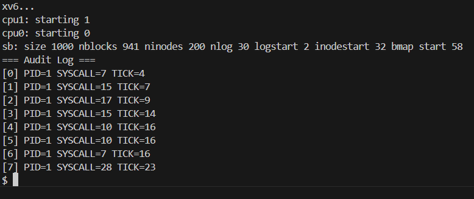

# 📝 Laporan Tugas Akhir

**Mata Kuliah**: Sistem Operasi
**Semester**: Genap / Tahun Ajaran 2024–2025
**Nama**: `<Mohamad Gilang Rizki Riomdona>`
**NIM**: `<240202903>`
**Modul yang Dikerjakan**:
`(Modul 5 – Audit dan Keamanan Sistem (xv6-public))`

---

## 📌 Deskripsi Singkat Tugas

**Modul 5 – Audit dan Keamanan Sistem:**:
  
* Merekam setiap pemanggilan system call dalam log audit kernel, menyediakan system call get_audit_log() untuk mengambil log tersebut (hanya untuk proses dengan PID 1), dan memastikan log tidak bisa diakses oleh proses biasa. Modul ini memperkenalkan mekanisme logging dan keamanan akses di level kernel.
---

## 🛠️ Rincian Implementasi

* Menambahkan struktur `struct audit_entry` dan `array audit_log[]` di file `syscall.c`
* Menambahkan logika pencatatan `system call` di dalam fungsi `syscall()`
* Menambahkan `system call` baru `get_audit_log()`:
  * Deklarasi di `user.h` dan `defs.h`
  * Implementasi di `sysproc.c`
  * Registrasi syscall di `usys.S` dan `syscall.h`
  * Menambahkan entri di tabel `syscall` pada `syscall.c`
* Membuat program uji `audit.c` untuk membaca dan menampilkan isi log auditl
* Menambahkan `_audit` pada bagian `UPROGS` di `Makefile`
---

## ✅ Uji Fungsionalitas

* `audit`: digunakan untuk menguji `syscall` `get_audit_log()`

---

## 📷 Hasil Uji

### 📍 Output `audit`:

```
=== Audit Log ===
[0] PID=1 SYSCALL=7 TICK=4
[1] PID=1 SYSCALL=15 TICK=7
[2] PID=1 SYSCALL=17 TICK=9
[3] PID=1 SYSCALL=15 TICK=14
[4] PID=1 SYSCALL=10 TICK=16
[5] PID=1 SYSCALL=10 TICK=16
[6] PID=1 SYSCALL=7 TICK=16
[7] PID=1 SYSCALL=28 TICK=23

```

Jika ada screenshot:





---

## ⚠️ Kendala yang Dihadapi

* Kesalahan dalam penggunaan `memmove()` karena tidak mengatur `argptr()` dengan ukuran buffer yang sesuai.
* Log audit awalnya dapat diakses oleh semua proses karena belum ada validasi PID dalam `syscall get_audit_log()`.

---

## 📚 Referensi

* Buku xv6 MIT: [https://pdos.csail.mit.edu/6.828/2018/xv6/book-rev11.pdf](https://pdos.csail.mit.edu/6.828/2018/xv6/book-rev11.pdf)
* Repositori xv6-public: [https://github.com/mit-pdos/xv6-public](https://github.com/mit-pdos/xv6-public)
* Stack Overflow, GitHub Issues, diskusi praktikum

---

